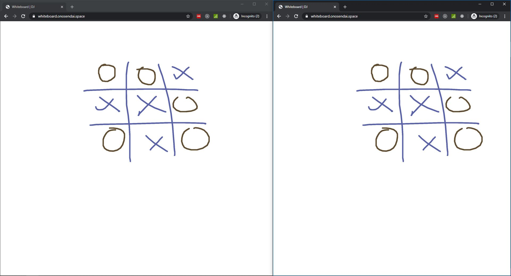

# Whiteboard

A websocket based canvas application that allows multiple users to concurrently draw on a surface

### Screenshot

The whiteboard app open in two different sessions

### Commands

A Breakdown of the Commands to Use this Project

| Command | Description |
|:---|:---|
| `yarn` | Install all dependencies |
| `yarn start` | Start Server |
| `yarn start:dev` | Start Development Server in watch mode |
| `yarn build:prod` | Build production client and server bundles |
| `yarn build:client:prod` | Build production client bundle |
| `yarn build:server:prod` | Build production server bundle |
| `yarn build:dev` | Build development client and server bundles |
| `yarn build:client:dev` | Build development client bundle |
| `yarn build:server:dev` | Build development server bundle |
| `yarn clean` | Purge compiled bundles folder |
| `yarn docker:build` | Build Production Docker Image |

### Technologies

- [Socket.io](https://socket.io)
- [Express](https://expressjs.com)
- [NodeJs](https://nodejs.org/en/)
- [Docker](https://www.docker.com/)
- [TravisCi](https://travis-ci.org/)

### Change Log

#### Update - 08/04/2020

- Fixed canvas resizing with adjustable debounce
- Increased resolution scaling for better line sharpness

#### Update - 07/04/2020

- Initial Touch Control Support
- Page Title

#### Update - 06/04/2020

- Non Interruptive Drawing
- Improved Client Filtering ( not quite there yet )
- Better State Structuring
- Bot Simulation
- Fill in Readme
- Reset endpoint redirects back to Page

#### Update - Project Start - 05/04/2020

- Initialise Project
- Build and Run Scripts
- Functioning Server / Client
- Docker and Travis Setup